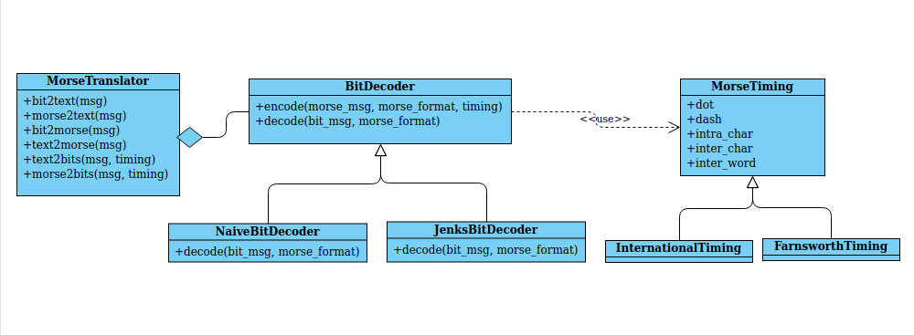
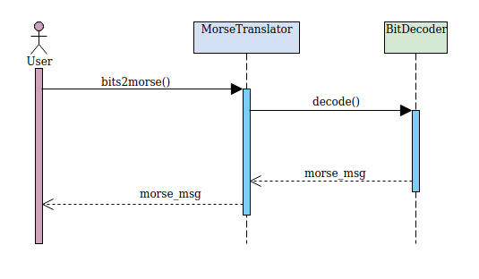

# Detalles de implementación
El presente code challenge fue implementado con *Python3*, utilizando el web framework *Flask* para la implementación de la API REST.

El web server de desarrollo que provee Flask no está pensado para ser utilizado en un entorno productivo, por lo que se utiliza en cambio *gunicorn* como Python Web Server Gateway Interface HTTP server.

La APP es hosteada en la plataforma cloud *Heroku* bajo la url https://morse4you.herokuapp.com/

La API se expone mediante *SwaggerUI* bajo la url https://morse4you.herokuapp.com/translate/v1/api/docs

## Desarrollo
El siguiente diagrama de clase expresa la modelización del problema a resolver:

El diseño propuesto busca resolver los siguientes problemas:

### Transmisión irregular
Dada una transmisión, es esperable que tanto los pulsos en la señal como las pausas entre pulsos tengan una duración variable, dado que es generada por un operador humano. Esto lleva que un mensaje tenga una codificación binaria no unívoca.

Ej.

**texto**:  `'HOLA'`
**morse**:  `'.... --- .-.. .-'`
**bits v1**: `'1 0 1 0 1 0 1   000 111 0 111 0 111 000 1 0 111 0 1 0 1  000 1 0 111'`
**bits v2**:`'11 0 11 0 11 00 111 00000 111111 000 111111 00 111111 0000000 111 0 11111111 0 111 0 111 0000000 11 000 111111'`

Dada una sequencia de bytes, existen distintas estrategias para poder discriminar los componentes de una señal (puntos, rayas, espacios entre palabras, etc). Cada estrategia puede procesar determinados patrones de señal de manera más efectiva, es por esto que me pareció interesante desacoplar la estrategia de decodificación de señales binarias del traductor, para poder aplicar la estrategia más adecuada dependiendo del tipo de señal.
Esto se ve reflejado en el diseño del modelo aplicando el patrón de diseño *Strategy*.

Para decodificar una transmisión de bits a código morse, se lleva adelante la siguiente secuencia:

 

Se implementan a modo de ejemplo dos estrategias diferentes:

* Naive: la estrategia ingenua consiste en determinar cuál es la duración mínima de un pulso para establecer, según el estandard, las duraciones de todos los componentes del código morse. Para cada secuencia binaria de 1s y 0s se asigna un componente del código morse cuya duración sea la más cercana a la duración de la secuencia.

Para una secuencia que respete el timing standard esta estrategia funciona muy bien, sin embargo, la estrategia ingenua no contempla las duraciones de los espacios, deriva todas duraciones a partir del pulso mínimo.

* Jenks: esta estrategia aplica el algorítmo de clasificación de [Jenks](https://en.wikipedia.org/wiki/Jenks_natural_breaks_optimization), buscando determinar los cortes naturales (natural breaks) en un conjunto de números. Este algoritmo permite clasificar un conjunto de números en distintas clases, donde se minimiza la varianza dentro de la clase y se maximiza la varianza entre clases. Conceptualmente es similar a clusterizar un array 1-dimensional utilizando *k-means*.

Por ejemplo: [1, 3, 4, 8, 10] puede clusterizarse en dos clases [1, 3, 4] y [8, 10].

La idea es poder clasificar la duración de las secuencias de bits para poder determinar qué duraciones representan por ejemplo un punto, y cuales una raya.

Este algorítmo no puede ser utilizado si la cantidad de clases es mayor a la longitud del array, por lo que no es eficiente para mensajes
cortos.

### Representación morse

Una de las dudas que fueron surgiendo a medida que se avanzaba en el desarrollo fue cómo representar el código morse. Dado que cualquier decisión sobre la representación resulta arbitraria decidí flexibilizar este aspecto pudiendo configurar el traductor morse con el formato deseado manteniendo una configuración default.

Una alternativa sería la utilización de un formato fijo, y utilizar un formateador de código morse externo al traductor. De esta manera, existiría un mayor desacoplamiento entre la lógica de traducción y la representación visual. Sin embargo, consideré que el formato era clave a la hora de expresar un mensaje en código morse, por lo que decidí integrar el manejo del formato en el traductor. En menor medida, generar código morse con el formato deseado resulta más performante.

### Codificación a binario *(Bonus)*

Me pareció interesante implementar una codificación de (morse/text)->binario. La codificación en código morse presenta algunos detalles que se deben tratar cuando se empieza a conocer más en profundidad el dominio del problema. A la hora de realizar una transmisión morse, existen distintos 'timings' para transmitir un mensaje. Es por eso que me pareció útil poder utilizar de manera dinámica distintos tipos de timing al codificar un mensaje a binario.

A modo de ejemplo, se proponen dos timings estandard, el internacional (default) y el timing de [Farnsworth](https://en.wikipedia.org/wiki/Morse_code#Farnsworth_speed).

## Testing
Los test del modelo y de la API fueron realizados con *pytest*, utilizando el test client de flask para levantar la app para probar los servicios REST.
 
Para correr los test se debe ejecutar el siguiente comando:
`flask test`

Se incluye en dicho comando la ejecucion de *coverage* para obtener estadísticas de cobertura sobre los test. Se buscó obtener una cobertura del 100% para la implementacion de la API y la implementación del traductor.

## Referencias
* [Python3](https://www.python.org)
* [Flask](https://www.palletsprojects.com/p/flask)
* [Heroku](http://heroku.com)
* [SwaggerUI](https://swagger.io/tools/swagger-ui/)
* [pytest](https://docs.pytest.org/en/latest/)
* [coverage](https://pypi.org/project/coverage/)

